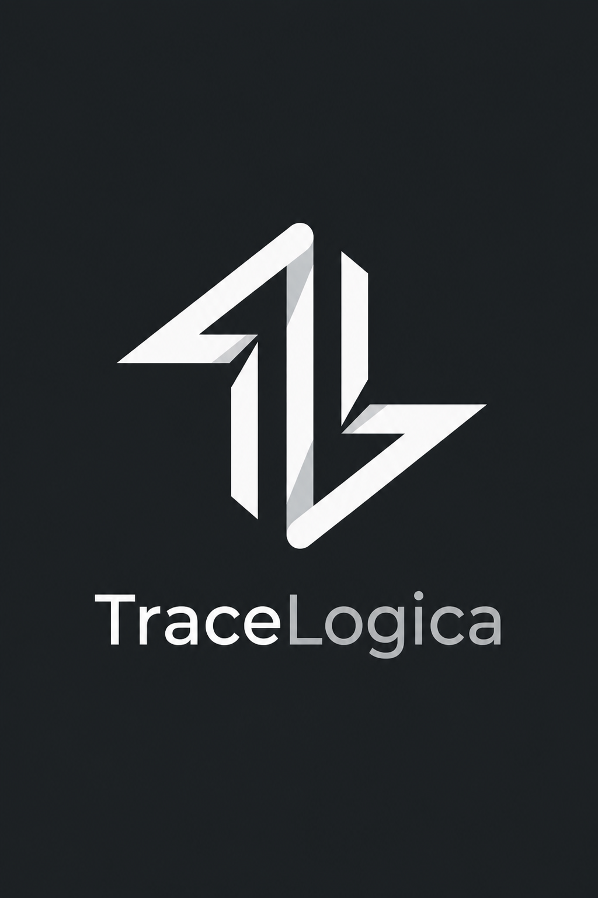

# TraceLogica documentation

TraceLogica is a signed checkpoint authority. It accepts opaque commitments to
an application's evidence-chain heads, durably orders them, and returns portable
Ed25519-signed receipts that can be verified without the application database.

The signed-checkpoint MVP is implemented but pre-release and not deployed. Its
approved claim is **independently verifiable, signed receipts from a separate
single authority**. It is not a blockchain, decentralized witness network,
trusted external timestamp, or proof that the source evidence is true or
complete.

## Start here

1. [Product overview](docs/overview.md)
2. [API quickstart](docs/api-quickstart.md)
3. [Core concepts](docs/concepts.md)
4. [System architecture](docs/architecture.md)
5. [Receipt verification](docs/proof-verification.md)
6. [Security and cryptography](docs/security.md)
7. [Status and compatibility](docs/status.md)

Reference material:

- [OpenTelemetry ingestion scope](docs/otlp-ingestion.md)
- [Glossary](docs/glossary.md)

## Documentation boundary

This public repository intentionally excludes credentials, private
infrastructure, operational runbooks, unreleased security analysis, and customer
data. Interfaces remain subject to change until a versioned release marks them
stable. Report suspected security issues using [SECURITY.md](SECURITY.md).



## Contributing

See [CONTRIBUTING.md](CONTRIBUTING.md). Documentation changes must not disclose
private implementation or infrastructure details.

## View the documentation site locally

The static site is generated directly from these Markdown files with Python's
standard library; there are no package dependencies to install.

```sh
make serve
```

Open `http://127.0.0.1:8000`. Run `make test` to build the site and check its
HTML structure, accessibility basics, internal links, anchors, and source-content
rendering. Generated files are written to `site/` and are not committed.
